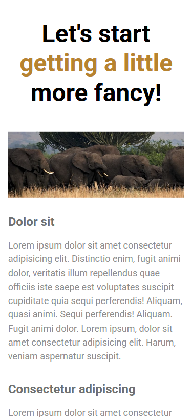
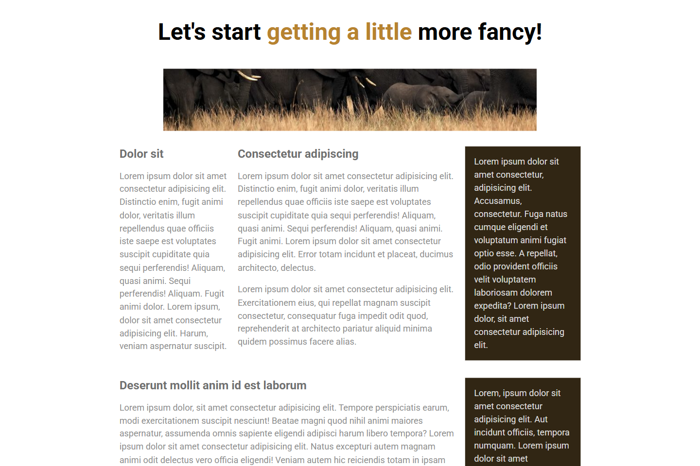

# 💻 Simple Landing Page

## ℹ️ A Simple Mobile-Friendly Landing Page

| _Mobile Preview (375x812)_                       | _Desktop Preview (1440x960)_                        |
| ------------------------------------------------ | --------------------------------------------------- |
|  |  |

A clean and mobile-friendly responsive landing page built using only semantic HTML and CSS. This project serves as a beginner-level demonstration of structured layout, content hierarchy, and responsive adaptation across screen sizes.

---

## 🔍 Overview

This project is a simple African safari-themed webpage demonstrating the author's understanding of responsive layout design. It’s a practice project focusing on clean structure, accessibility, and media query usage.

The layout adapts to various screen sizes using Flexbox, and is fully functional without any JavaScript. The page content is organized using semantic HTML elements for better readability and accessibility.

---

## ✨ Features

- Mobile-first layout with media queries
- Flexbox-based responsive sections
- Semantic structure using `<section>`, `<article>`, `<aside>`
- Custom properties for scalable theming
- Clean typography and spacing
- Accessible and descriptive `alt` attributes
- Meaningful meta tags for SEO and sharing

---

## 🧠 What I Learned

- Creating layouts using Flexbox and nested containers
- Organizing content with semantic HTML
- Implementing **mobile-first** media queries
- Using CSS custom properties for better maintainability
- Building clean, readable, and accessible markup
- Writing a professional and scalable stylesheet

---

## 🛠️ Tech Used

- HTML5
- CSS3
- Git
- GitHub
- Netlify

---

## 🚀 How to Run

1. Clone the repository
2. Open `index.html` in your browser

---

## 🌐 Live Demo

Or you can check out the 👉 [live website here](https://simple-landing-page-jiro.netlify.app/)

---

## 🧑‍💻 Author

Created by **Elmar Chavez**

🗓️ Month/Year: **May 2025**

📚 Journey: **2nd** month of learning _frontend web development_.
